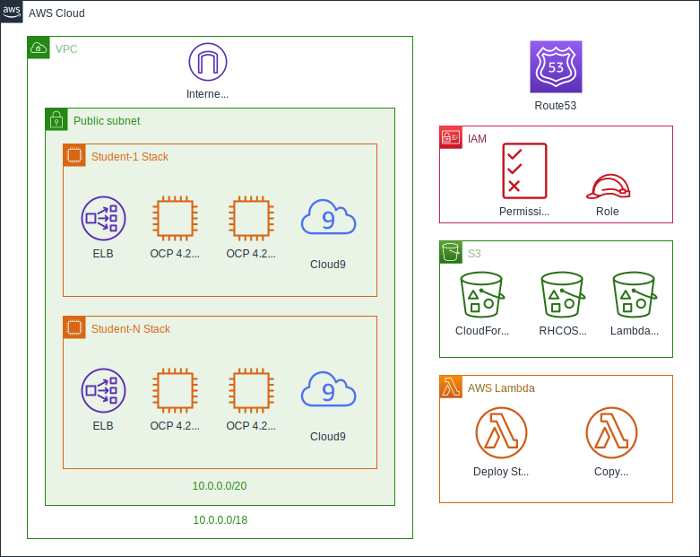

# aws-ocp

## Overview

The solution within this repository deploys an All-in-One(AIO) OpenShift 4.x cluster into an AWS region to be used as a lab or a training environment.



## Deployment

There are two ways to deploy - either using [taskcat](https://github.com/aws-quickstart/taskcat) or the CloudFormation console. CloudFormation console deployment expects this repository in an S3 bucket. Taskcat is a CLI based approach and requires the installation and configuration of the taskcat library. Tascat creates the S3 bucket for all of the CloudFormation assets, uploads the entire repo and deploys the stack.

### Deploy using CloudFormation

1. Upload this repository to an S3 bucket. Note the Object URL for the [aws-ocp-master.template.yml](templates/aws-ocp-master.template.yml) file.
2. Create a new CloudFormation stack by using the Object URL from step 1.
3. Fill out the deployment parameters and deploy the stack.
4. After the stack is done deploying, navigate to the *Ouputs* tab of the master deployment and use the *WorkshopWebpage* output to browse to the workshop webpage.

### Deploy using taskcat

1. Install taskcat by following the [taskcat installation instructions](https://aws-quickstart.github.io/install-taskcat.html)

2. Update the [parameter overrides](https://github.com/aws-quickstart/taskcat#parameter-overrides) by creating `<PROJECT_ROOT>/.taskcat_overrides.yml` file. Use the example below as a starting point:

```yaml
ClusterName: <CLUSTER NAME>
# Lock down access to the lab to a specific CIDR,
# defaults to 0.0.0.0/0
RemoteAccessCIDR: "73.42.71.116/32"
NumStudents: "2"
# Have to pass SSH key due to a RHCOS requirement
SSHKey: "<PASTE YOUR PUBLIC SSH KEY HERE>"
# Single quotes because the pull secret string contains double quotes
PullSecret: '<PASTE PULL SECRET HERE>'
```

3. Deploy the stack

```bash
# Runing the taskcat test command with -n flag creates the stack and doesn't destroy it
taskcat test run -n
```

### OCP 4.x Deployment Parameters

| Parameter            | Example                                 | Description                                                           |
| ---------------------| --------------------------------------- | --------------------------------------------------------------------- |
| OpenShiftVersion     | "4.2"                                   | OpenShift version                                                     |
| ClusterName          | "ocp42class"                            | OpenShift cluster name                                                |
| HostedZoneName       | "openshift.awsworkshop.io"              | Route53 hosted zone name                                              |
| NumStudents          | "20"                                    | Number of student environments to provivision                         |
| RemoteAccessCIDR     | "1.2.3.4/32"                            | Lock down access to the lab to a specific CIDR, defaults to 0.0.0.0/0 |
| PullSecret           | '{"auths":{"cloud.openshift.com": ... ' | Pull secret obtained from [cloud.redhat.com](https://cloud.redhat.com/openshift/install), it's big |
| SSHKey               | "ssh-rsa AAAAB3NzaC1ycAAA ..."          | Public SSH key for ssh access                                         |
| RhcosAmi             | "ami-08e10b201e19fd5e7"                 | RHCOS AMI ID                                                          |
| AvailabilityZone     | "us-west-2a"                            | Has to correspond to the region                                       |
| CreateCloud9Instance | "yes"                                   | Create cloud9 environment?                                            |
| QSS3BucketName       | "tcat-t3-test6-48ska2s"                 | S3 bucket for CloudFormation templates                                |
| QSS3KeyPrefix        | "aws-ocp/"                              | S3 bucket path for CloudFormation templates, mainly used for taskcat  |

## StackDirector Lambda

This lambda is responsible for building the student stacks, installing OCP 4.x cluster, and performing post installation activities. After the stack build is initiated, the lambda runs every hour to do the health check and post installation activities. Once every cluster passes the health check, the lambda deletes the 1 hour check event and never runs again.

### Logic flow

* Build student stacks
  * Download and install the openshift-install binary
  * Generate the [ignition files](https://coreos.com/ignition/docs/latest/what-is-ignition.html) and upload to S3
  * Generate the parameter file for the CloudFormation stacks and upload to S3
  * Build the CloudFormation stacks
  * Generate the workshop webpage and upload to S3
* Post deployment tasks
  * Run health check against each cluster
  * Run the [openshift-4-scale-replicas](functions/source/StackDirector/bin/openshift-4-scale-replicas) script
  * Rebuild any stacks that are failling health check
  * Generate the workshop webpage and upload to S3

### Building the lambda

We use Docker to install the Python library dependencies and package the lambda into a zip.

```bash
make build_lambda
```

## Troubleshooting

### Deleting massive scale stacks

Sometimes the StudentStack lambda can fail to clean up and you require a way to quickly remove the stacks. Here is some sample code to clean this up:

```python
    import boto3
    cf_client = boto3.client("cloudformation")
    cluster_name = "ClusterName input param"
    to_detel = cf_client.list_stacks(StackStatusFilter=["ROLLBACK_FAILED", "DELETE_FAILED"])
    for stack in to_detel["StackSummaries"]:
      if cluster_name in stack["StackName"]:
        response = cf_client.delete_stack(StackName=stack["StackName"])
        response["ResponseMetadata"]["HTTPStatusCode"]
```

### Taskcat

We have seen issues running taskcat under the following conditions, please verify:

  * Your Environment variables for AWS are what you want as they override your `~/.aws/credentials` and `~/.aws/config` * You have initialized and updated the git submodules
  * You Account has the correct IAM Permissions to execute in the region.
  * Your default region and test region match.

#### Orphaned S3 Buckets

To clean up all Taskcat buckets you can run the following at your own risk.

```bash
aws s3 ls | grep tcat | cut -d ' ' -f 3 | xargs -I {} aws s3 rb s3://{} --force
```
